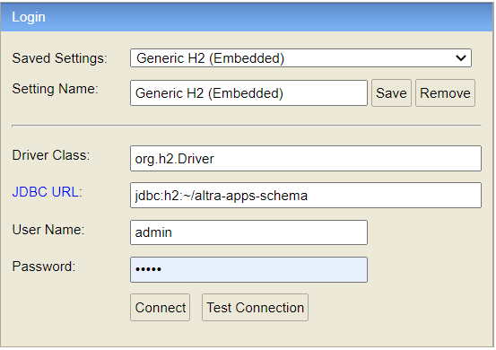

# Altra Apps Schema

## Requirements

Building the API client library requires:

1. OpenJDK 16+
2. Maven 3.5+
3. Docker (for running NOSQL DB only)

## Installation

To install the API client library to your local Maven repository, simply execute:

```shell
mvn clean install
```

## Getting Started

### Run project locally with SQL DB (H2)

1. run `mvn spring-boot:run` from console to start the application Or use IDE and run
   the `AltraAppsSchemaApplication.java`

When the application runs successfully

1. Test data (defined in `ProjectTestDataLoader.java`) is created in H2 database
2. Data model Json file is generated in console logs
3. h2-console is available to access the database at http://localhost:9000/h2-console
   

### Run project locally with NoSQL DB (MongoDB)

1. Go to /docker-compose and run `docker-compose up` to start Mongo DB and Mongo express docker instances
2. Go to `http://localhost:8081/` and create altra-apps-schema DB
3. Follow all steps defined under `Steps to run the project locally with SQL DB (H2)`

NOTE! NoSQL setup is not working as per new schema changes.