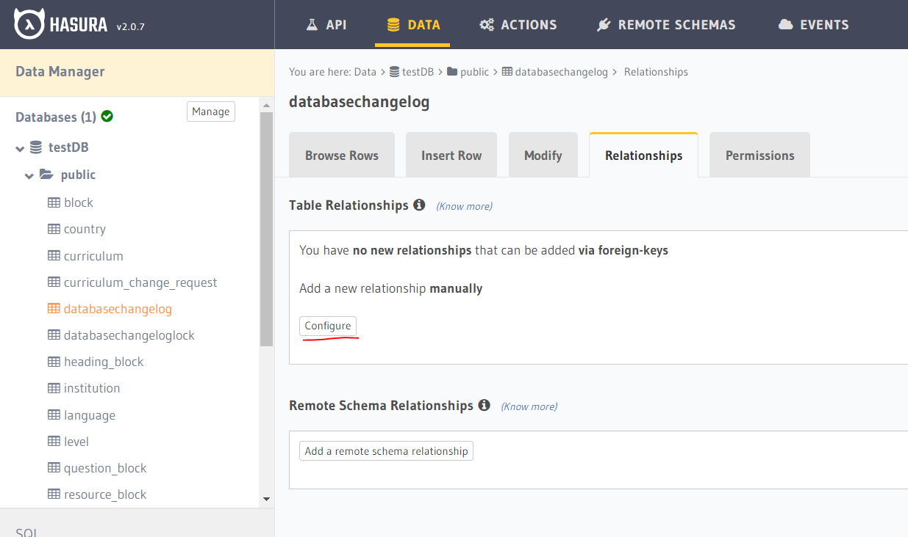

# Altra Apps Schema

## Requirements

Building the API client library requires:

1. OpenJDK 16+
2. Maven 3.5+
3. Docker

## Installation

To install the application to your local Maven repository, simply execute:

```shell
mvn clean install
```

## Getting Started
1. Go to docker-compose folder and run `docker-compose up` to start docker containers for:
   1. postgres DB
   2. Hasura (graphql-engine) 
   3. Mongo DB 
   4. Mongo express docker instances
2. For MongoDB configuration, use `http://localhost:8081/` to create altra_apps_schema database for application
3. For Hasura configuration, use `http://localhost:8080/console/` to 
   1. Connect to the postgres DB
   2. Create new database 
   3. Visit each table and verify relationship configuration
      

When the application runs successfully

1. Test data (defined in `ProjectTestDataLoader.java`) is created in postgresDB 
2. Data model Json file is generated in console logs

#### PostgresDB configuration


NOTE! NoSQL setup is not working as per new schema changes.